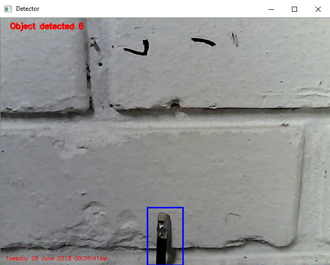

# Move Detector

Move detector is an algorithm designed for the counting of objects in movement. Specifically, this algorithm allows to count the number of objects that cross the field of vision of a camera, in a vertical direction. For using it uses the following libraries: 

* Imutils.
* OpenCv.

Example:

 
